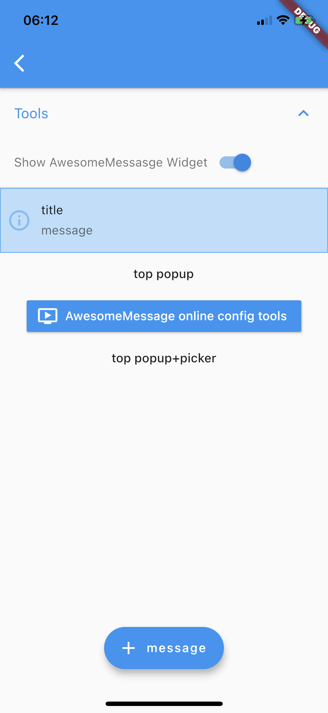
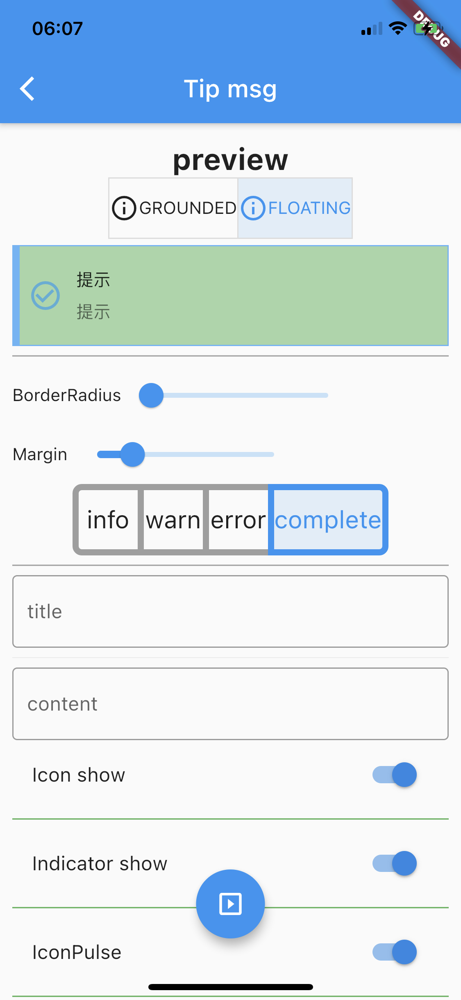

## 代码结构

向外导出：awesome_message.dart

主要实现：

- awesome_helper.dart：定义了 class `AwesomeHelper` 工具类；  
- awesome_message.dart：定义了 class `AwesomeMessage` extends StatefulWidget；  
- awesome_message_route.dart：定义了 class `AwesomeMessageRoute` extends OverlayRoute；  

示例依赖 [airoute](https://github.com/pdliuw/airoute)。

## 核心接口

AwesomeHelper.createAwesome 返回 AwesomeMessage。

_AwesomeMessageState.build 返回 Align(child: _getAwesomeMessage(),)。

_getAwesomeMessage 中非 userInputForm 布局：Stack.children = [FutureBuilder, awesomeMessage]。

```Dart
// awesome_message.dart
  Widget _getAwesomeMessage() {
    Widget awesomeMessage;

    if (widget.userInputForm != null) {
      awesomeMessage = _generateInputAwesomeMessage();
    } else {
      awesomeMessage = _generateAwesomeMessage();
    }

    return Stack(
      children: [
        FutureBuilder(
          future: _boxHeightCompleter.future,
          builder: (context, AsyncSnapshot<Size> snapshot) {

          }
        ),
        awesomeMessage,
      ]
    )
```

### _generateAwesomeMessage

- Container.child = Column;  
- Column.children = [LinearProgressIndicator?, Row];  
- Row.children = children: _getAppropriateRowLayout();  

```Dart
  Widget _generateAwesomeMessage() {
    return Container(
      key: backgroundBoxKey,
      constraints: widget.maxWidth != null
          ? BoxConstraints(maxWidth: widget.maxWidth!)
          : null,
      decoration: BoxDecoration(
        color: widget.backgroundColor,
        gradient: widget.backgroundGradient,
        boxShadow: widget.boxShadows,
        borderRadius: BorderRadius.circular(widget.borderRadius!),
        border: widget.borderColor != null
            ? Border.all(color: widget.borderColor!, width: widget.borderWidth!)
            : null,
      ),
      child: Column(
        mainAxisSize: MainAxisSize.min,
        children: [
          widget.showProgressIndicator
              ? LinearProgressIndicator(
                  value: widget.progressIndicatorController != null
                      ? _progressAnimation.value
                      : null,
                  backgroundColor: widget.progressIndicatorBackgroundColor,
                  valueColor: widget.progressIndicatorValueColor,
                )
              : _emptyWidget,
          Row(
            mainAxisSize: MainAxisSize.max,
            children: _getAppropriateRowLayout(),
          ),
        ],
      ),
    );
  }
```

### _getAppropriateRowLayout

- RowLayout = [leftBarIndicator(FutureBuilder), ConstrainedBox(icon), Expanded];
- Expanded.children = Column;  
- Column.children = [Padding(titleText), Padding(messageText)];  

```Dart
// awesome_message.dart
  List<Widget> _getAppropriateRowLayout() {

    } else if (widget.icon != null && widget.mainButton == null) {
      return <Widget>[
        _buildLeftBarIndicator(),
        ConstrainedBox(
          constraints: BoxConstraints.tightFor(width: 42.0 + iconPadding),
          child: _getIcon(),
        ),
        Expanded(
          flex: 1,
          child: Column(
            crossAxisAlignment: CrossAxisAlignment.stretch,
            mainAxisSize: MainAxisSize.min,
            children: <Widget>[
              (_isTitlePresent)
                  ? Padding(
                      padding: EdgeInsets.only(
                        top: widget.padding!.top,
                        left: 4.0,
                        right: widget.padding!.left,
                      ),
                      child: _getTitleText(),
                    )
                  : _emptyWidget,
              Padding(
                padding: EdgeInsets.only(
                  top: _messageTopMargin,
                  left: 4.0,
                  right: widget.padding!.right,
                  bottom: widget.padding!.bottom,
                ),
                child: widget.messageText ?? _getDefaultNotificationText(),
              ),
            ],
          ),
        ),
      ];
    }

  }
```

## 使用方式

### 作为Widget使用

```Dart
          Container(
            child:
                AwesomeHelper.createAwesome(title: "title", message: "message"),
          ),
```

### 作为Route使用

```Dart
          Navigator.push(
            context,
            AwesomeMessageRoute(
              awesomeMessage: AwesomeHelper.createAwesome(
                  title: "title", message: "message"),
              theme: null,
              settings: RouteSettings(name: "/messageRouteName"),
            ),
          );
```

## 示例效果

首页（main.dart）点击 next 按钮，打开 PopupPage（popup_page.dart）。

### PopupPage

Tools 是一个下拉 ExpansionTile，其中 Switch 控制变量 _showMessageWidget 决定是否在页面中间展示作为 Widget 使用的效果。

```Dart
          Container(
            child: _showMessageWidget
                ? AwesomeHelper.createAwesome(
                    title: "title", message: "message")
                : Text(""),
          ),
```



### ToolPage

在 PopupPage 页面点击 online config tools 按钮，打开 AiAwesomeMessageToolPage 页面（tool_page.dart）。

- ToggleButtons-GROUNDED/FLOATING：控制是否全屏覆盖顶部状态栏；  
- Margin：控制 message toast 两侧边距；  
- Indicator show：控制是否显示左侧显示条；  
- ToggleButtons-info/warn/error/complete：控制显示消息的类型；  


